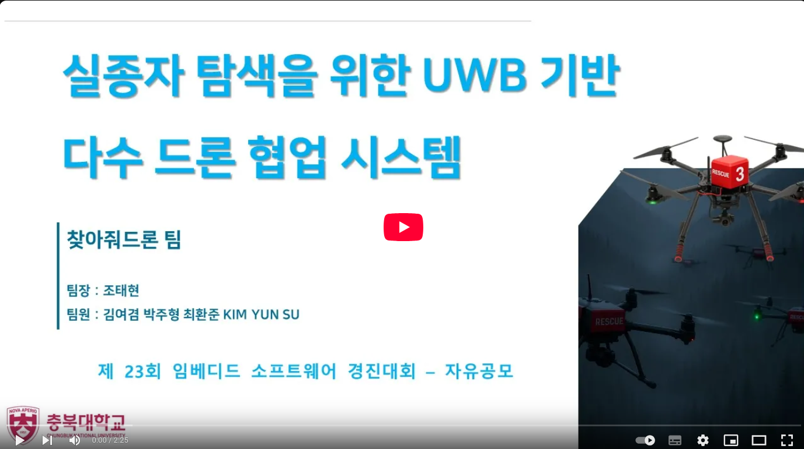
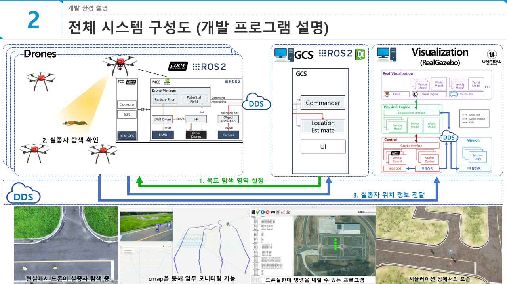
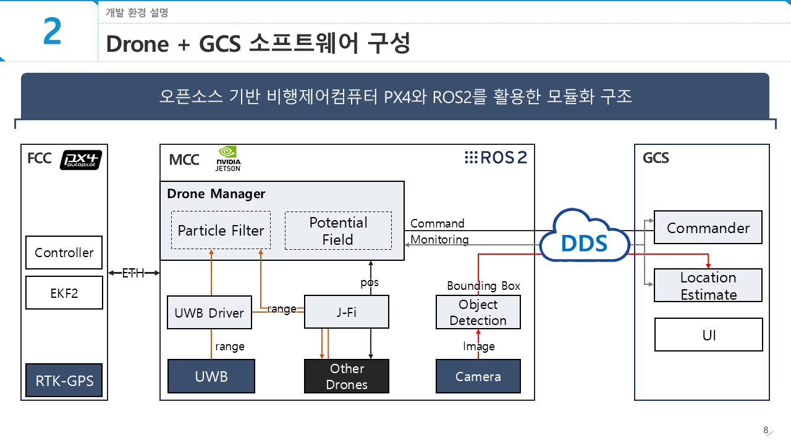
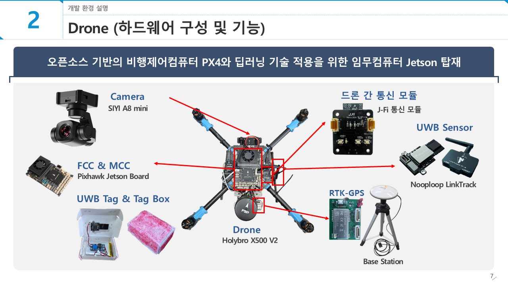

# 제23회 임베디드 소프트웨어 경진대회 찾아줘드론 소스코드

## 소개

### 실종자 탐색을 위한 UWB 기반 다수 드론 협업 시스템
* 기존의 드론을 활용한 실종자 탐색 기술이 가진 한계를 극복하기 위해 개발된 실종자 탐색 시스템입니다.

#### 핵심 기술 및 특징
* 이동형 UWB 앵커 : 여러 대의 드론이 군집 비행하며 이동형 UWB 앵커 네트워크를 형성합니다.
* RTK-GPS 기반 위치 보정: RTK-GPS를 통해 드론의 위치를 센티미터 오차로 정밀하게 보정합니다.
* 실시간 정밀 측위: UWB 태그를 부착한 대상의 위치를 센티미터급 정밀도로 추정합니다.
* 유연한 탐색 영역 확장: 드론 군집의 배치와 이동을 통해 원하는 지역에 유연하게 측위 범위를 확장할 수 있습니다.

## 시스템 구조

### 소프트웨어 구성

### 하드웨어 구성

## 활용 오픈소스

### [PX4-AutoPilot](https://github.com/PX4/PX4-Autopilot)
* [PX4](https://px4.io/)는 NuttX 실시간 운영체제(RTOS) 위에서 구동되는 강력한 오픈소스 자율비행 소프트웨어입니다.

### [Realgazebo](https://github.com/SUV-Lab/RealGazebo-ROS2)
* [Realgazebo](https://airgazebo.theseung.com/)는 Gazebo와 AirSim을 통합하여 대규모의 이종(異種) 무인 이동체 시뮬레이션을 지원하는 통합 시뮬레이션 플랫폼입니다.

### [SIYI_SDK](https://github.com/SUV-Lab/siyi_sdk)
* [SIYI A8 mini](https://shop.siyi.biz/products/siyi-a8-mini-gimbal-camera) 카메라를 ROS2 시스템에서 사용하기 위한 SDK 모듈입니다.

### [nlink_parser_ros2](https://github.com/Porofly/nlink_parser_ros2)
* [linktrack](https://www.nooploop.com/linktrack/) UWB 센서를 ROS2 시스템에서 사용하기 위한 드라이버 모듈입니다.

### [J-Fi](https://github.com/SUV-Lab/J-Fi)
* [J.Fi](https://jmarple.ai/j-fi/) 통신 모듈을 ROS2 시스템에서 사용하기 위한 드라이버 모듈입니다.
