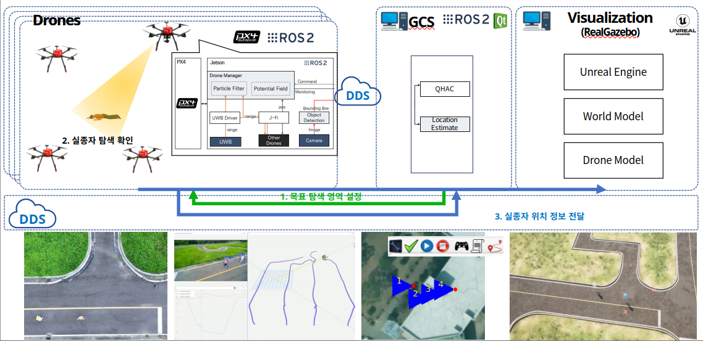
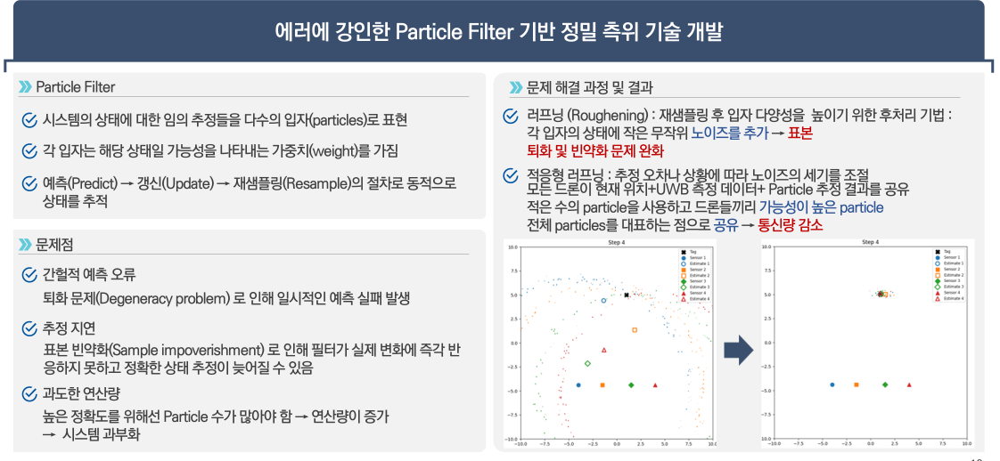
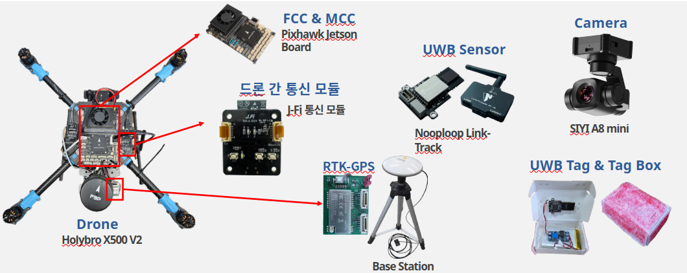

# 제23회 임베디드 소프트웨어 경진대회 찾아줘드론 소스코드

## 소개

## 시스템 구조

## 소프트웨어 구성

## 하드웨어 구성

## 활용 오픈소스

### [PX4-AutoPilot](https://github.com/PX4/PX4-Autopilot)

### [Realgazebo](https://github.com/SUV-Lab/RealGazebo-ROS2)

### [카메라 드라이버](https://github.com/SUV-Lab/siyi_sdk)

### [UWB 드라이버](https://github.com/Porofly/nlink_parser_ros2)

### [통신 모듈](https://github.com/SUV-Lab/J-Fi)
